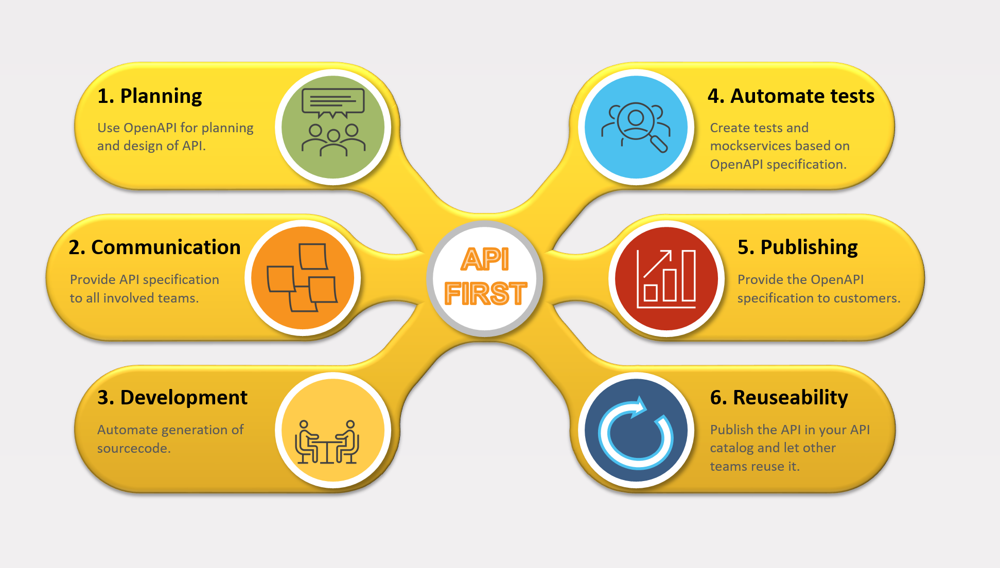

# Hello API First
Hello API First shall give some hands-on introductions to API First approach, 
and how to implement it with different languages and frameworks.

## What is API First?
API-first refers to the approach of designing and building software RESTful applications
by prioritizing the development of the application programming interfaces (APIs) 
that will be used by other applications or services to interact with the application.

In this approach, the API is considered the primary interface of the application, 
and it is developed first before any other components. 

It is language and device agnostic, and it is not tied to any specific technology stack.
This makes it easy to integrate with any RESTful application or service.

## What is OpenAPI?
OpenAPI is the most popular standard used in API-first approach.
OpenAPI is a specification for machine-readable interface files for describing, producing, consuming, and visualizing RESTful web services.
The OpenAPI document can be used in a vast variety of tools, from design-first to code-first to mock servers to documentation generators.

## Why API First?
By adopting an API-first approach, developers can create more modular and reusable software architectures,
as well as facilitate integration with other applications and services.
It also enables developers to build applications that are independent of the user interface,
making it easier to adapt the application to different devices and platforms.

It is very important for outside developers to be able to use your API to build their own applications based on your data.

## How to use API First?
API First is a design approach, not a technology.
It is a way of thinking about how to design and build software applications.
This repository will give you examples of API First approach in different languages and frameworks.

## Wording
Just making sure we are talking about the same things here.
### OpenAPI
API First could be used also with other standards like RAML. But here we will talk only about OpenAPI.
### OAS3
OpenAPI can be abbreviated as OAS3, which is also version 3. There is a version 2, which is called Swagger. But here we will only talk about OAS3.
### API
Will here always mean RESTful API.
### OpenAPI specification
Will always mean the OAS3 standard, the specification.
And not the specific document for a specific API.
It is described here: 
[OpenAPI](https://swagger.io/docs/specification/about/)
### OpenAPI document
This will describe the specific API.
Not the OAS3 specification.
It can often be accessed by the application like this: http://localhost:8080/v3/api-docs.
But that depends very much on the framework and language you are using for your API implementation.

## API First in a typical application lifecycle
### 1. Planning
The first step in the API-first approach is to define the API.
### 2. Communication
Business talks with developers about the API.
### 3. Development
Implementation of the API.
### 4. Testing
Automated tests for the API with API First tools.
### 5. Publishing
Publishing the API to the public.
### 6. Reusability
Reuse the API in other applications.
### 7. Graphical overview

